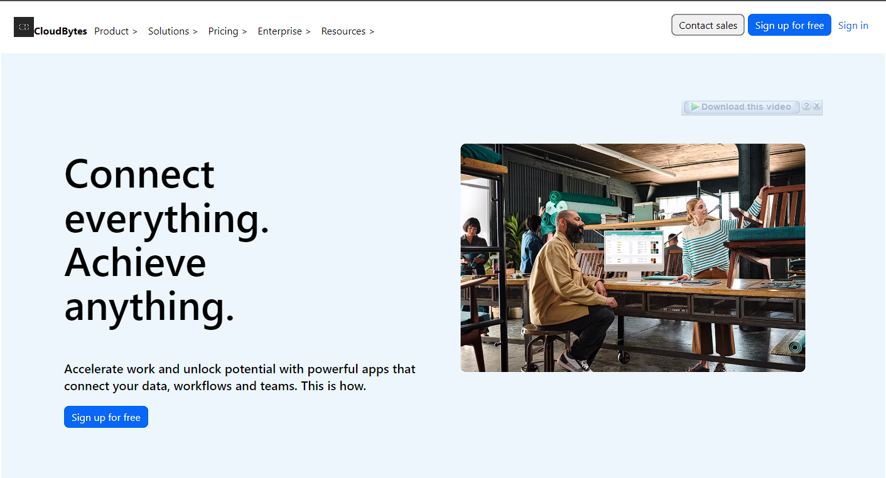

# CloudByte : Connect everything. Achieve anything.
---------------------------------------------------------
### CloudByte.com is an impressive front-end project crafted with HTML, CSS, and JavaScript.CloudByte.com is an exceptional cloud platform that empowers businesses to connect all aspects of their operations, enabling them to achieve remarkable results.

# Overview

## Tech Stack
* HTML
* CSS
* JavaScript

## Key Features
------------------
### Homepage carousel slideshow
### Login and SignUp User Account
### Sliding and Functionality

## Conclusion
----------------
### CloudByte.com seamlessly integrates data, workflows, and teams, accelerating work processes and unlocking the full potential of organizations. By providing a unified and collaborative environment, CloudByte.com revolutionizes productivity, enabling businesses to streamline operations, enhance efficiency, and achieve unparalleled success. Experience the transformative power of CloudByte.com and witness how it redefines the way businesses work, collaborate, and thrive in the cloud-powered era.
